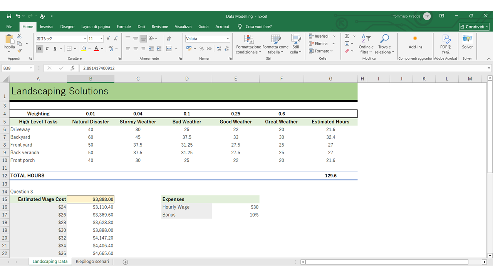

# Excel-Data-Modelling
Applied functions on the worksheet: SUMPRODUCT, Data Tables, Goal Seek, Scenario Manager, Solver

# To-Do List
- If there is great weather, the company takes the following hours to complete a driveway, backyard, front yard, back verandah, and front porch: 20, 30, 25, 25, and 20 hours respectively. Good weather increases all times by a factor of 1.1. Bad weather increases all times by a factor of 1.25. Stormy weather increases all times by a factor of 1.5. A natural disaster increases all times by a factor of 2.0
Great weather, good weather, bad weather, stormy weather, and a natural disaster have the following probabilities of occurrence: 0.6, 0.25, 0.1, 0.04, and 0.01 respectively. All these probabilities (weightings) sum to 1.Use SUMPRODUCT to calculate the estimated hours of work to complete the landscaping.
- The labourers hourly wage is $30 an hour. In B15, calculate the estimated wage cost, without bonuses, given the estimated hours of work. What is the estimated wage cost?
- In A15:B22, create a Data Table that calculates the estimated wage cost for wage rates from $24 an hour to $36 an hour in increments of $2 an hour. What is the sum of all the estimated wages in your data table (B16:B22)?
- In A26, calculate the estimated wage cost with a bonus rate of 10%. In A26:G34, create a Data Table that calculates the estimated wage cost for wage rates from $24 an hour to $38 an hour in increments of $2 an hour, including bonuses for the workers ranging from 5% to 10% in increments of 1%. What is the sum of all the estimated wages in your data table (B27:G34)?
- It has been estimated the company's revenues per week can be estimated by the equation revenue = (240 - 30Q)*1000Q where Q is the number of gardens attended to per week. In B39, calculate the total revenue if the quantity is 1. What is the total revenue?
- It has been estimated the company's costs per week can be estimated by the equation cost = (120 + 8Q)*1000 where Q is the number of gardens attended to per week. In B40, calculate the total cost if the quantity is 1. What is the total cost?
- What is the total profit if the quantity is 1?
- Use Solver to calculate the quantity that maximises the profit per week.
- Use Goal Seek to calculate: What is the quantity required to generate a profit of $300,000 per week?

## Preview

